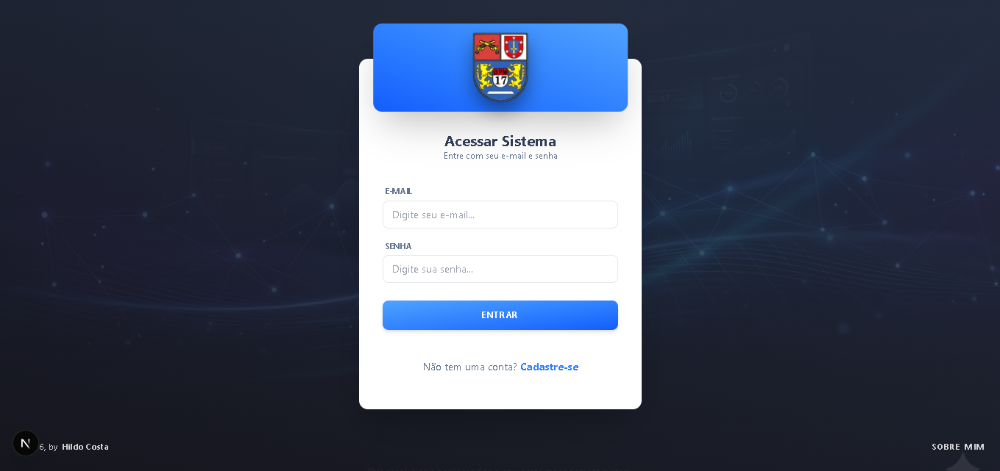
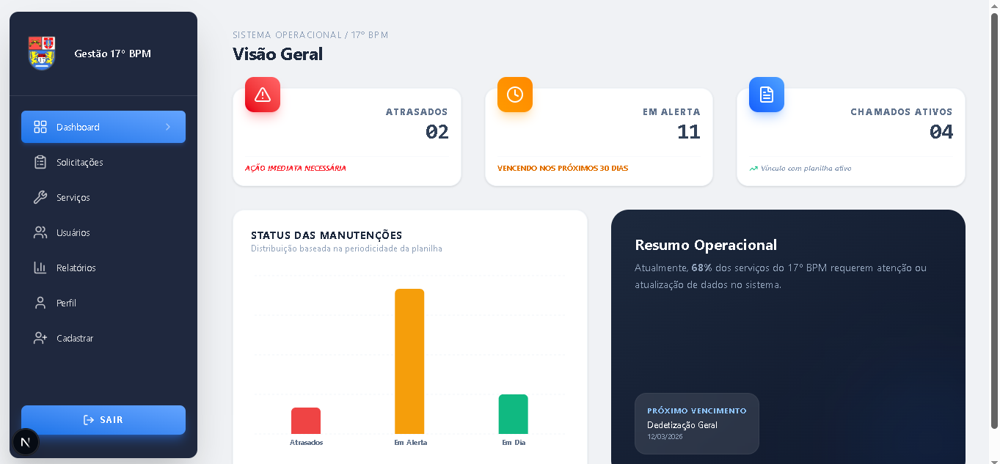
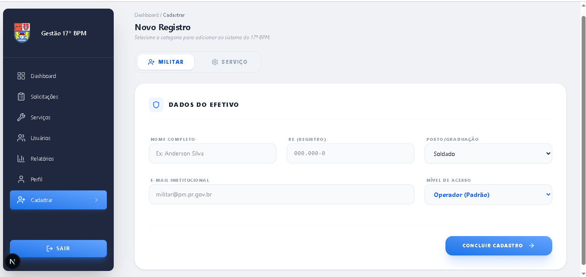
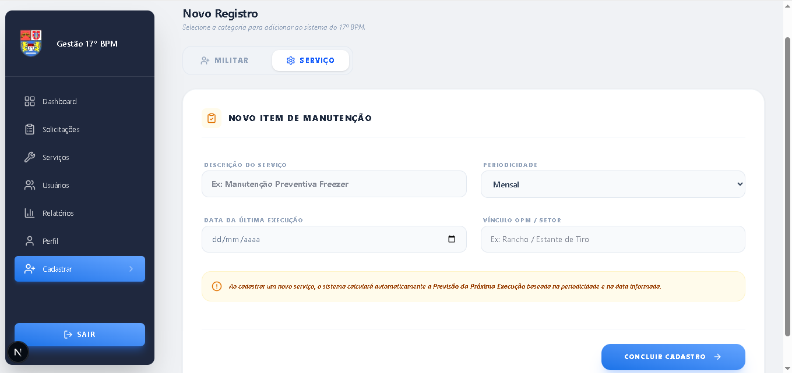

# 🛡️ Sistema de Gestão Interna - 17º BPM

<p align="center">
  
  
  
  
</p>

<p align="center">
  <strong>Plataforma inteligente para otimização de fluxos administrativos e controle operacional.</strong>
</p>

---

## 📖 Sobre o Projeto

O **Sistema de Gestão Interna - 17º BPM** é uma solução digital desenvolvida para centralizar e modernizar processos de gestão. O objetivo principal é converter fluxos de trabalho manuais em uma plataforma digital de alta performance, garantindo a organização de dados, agilidade na consulta de informações e uma interface intuitiva para o usuário final.

Construído com **Next.js 15** e **React 19**, o sistema entrega uma experiência veloz, segura e preparada para escala.

---

## 📸 Demonstração da Interface (Visual Preview)

<p align="center">
  Abaixo, apresentamos os fluxos principais já implementados. Toda a interface utiliza **dados simulados (Mock Data)** para validar a usabilidade antes da integração com o banco de dados.
</p>

<table width="100%" border="0" cellspacing="0" cellpadding="0">
  <tr>
    <td width="50%" valign="top" style="padding: 10px;">
      <div align="center" style="border: 1px solid #eaecef; border-radius: 12px; padding: 20px; height: 100%; box-shadow: 0 2px 4px rgba(0,0,0,0.05);">
        <p align="center">
          
        </p>
        <p align="center" style="font-size: 11px; color: #586069; margin-top: 5px; margin-bottom: 15px; min-height: 25px;">
          Autenticação segura para militares do 17º BPM.
        </p>
        
      </div>
    </td>
    <td width="50%" valign="top" style="padding: 10px;">
      <div align="center" style="border: 1px solid #eaecef; border-radius: 12px; padding: 20px; height: 100%; box-shadow: 0 2px 4px rgba(0,0,0,0.05);">
        <p align="center">
          
        </p>
        <p align="center" style="font-size: 11px; color: #586069; margin-top: 5px; margin-bottom: 15px; min-height: 25px;">
          Visão geral com indicadores de manutenção e efetivo.
        </p>
        
      </div>
    </td>
  </tr>

  <tr>
    <td width="50%" valign="top" style="padding: 10px;">
      <div align="center" style="border: 1px solid #eaecef; border-radius: 12px; padding: 20px; height: 100%; box-shadow: 0 2px 4px rgba(0,0,0,0.05);">
        <p align="center">
          
        </p>
        <p align="center" style="font-size: 11px; color: #586069; margin-top: 5px; margin-bottom: 15px; min-height: 25px;">
          Fluxo de registro de militares e níveis de acesso.
        </p>
        
      </div>
    </td>
    <td width="50%" valign="top" style="padding: 10px;">
      <div align="center" style="border: 1px solid #eaecef; border-radius: 12px; padding: 20px; height: 100%; box-shadow: 0 2px 4px rgba(0,0,0,0.05);">
        <p align="center">
          
        </p>
        <p align="center" style="font-size: 11px; color: #586069; margin-top: 5px; margin-bottom: 15px; min-height: 25px;">
          Gestão de manutenções preventivas e periódicas.
        </p>
        
      </div>
    </td>
  </tr>
</table>

## 🏗️ Estratégia de Desenvolvimento (MVP)

O projeto adota uma metodologia **Frontend-First**, priorizando a validação da experiência do usuário e a arquitetura visual:

- **Foco em UI/UX:** Interface de alta fidelidade, desenvolvida para ser limpa, moderna e funcional.
- **Simulação de Dados (Mock Data):** Para validar a navegabilidade e as regras de negócio de forma ágil, o sistema utiliza dados simulados. Isso permite testar toda a jornada do usuário antes da integração definitiva com o banco de dados.
- **Prototipagem Funcional:** Estados de clique, fluxos de navegação e transições já estão totalmente operacionais.

---

## 🚀 Status do Desenvolvimento

### ✅ Já Implementado
- **Módulo de Acesso:** Telas de Login e Cadastro com validação de formulários.
- **Navegação Inteligente:** Menu lateral dinâmico com reconhecimento de página ativa.
- **Design System v2:** Padronização de componentes via Tailwind CSS (v4) com suporte a gradientes lineares.
- **Gestão de Usuários & Serviços:** Interface unificada para cadastro de efetivo e itens de manutenção.
- **UX Polida:** Feedback visual de sucesso (Toasts), transições de entrada e cursor interativo em toda a aplicação.
- **Gestão de Sessão:** Fluxo de saída (Logout) com transições suaves.

### 📈 Roadmap (Próximas Etapas)
1.  **📊 Painel de Indicadores:** Visualização de métricas e estatísticas em tempo real (Dashboard).
2.  **🔧 Central de Serviços:** Tabela dinâmica para gerenciamento de solicitações e prazos de manutenção.
3.  **👥 Níveis de Permissão:** Lógica de controle de acesso baseada no perfil do usuário (Operador/Gestor/Adm).
4.  **📄 Relatórios Gerenciais:** Exportação de dados consolidados em PDF e Excel para o 17º BPM.

## 🛠️ Stack Tecnológica

| Ferramenta | Aplicação |
| :--- | :--- |
| **Next.js 15** | Framework Estrutural (App Router) |
| **React 19** | Componentização e Lógica de Interface |
| **Tailwind CSS** | Estilização Modernas e Responsividade |
| **Lucide React** | Biblioteca de Ícones |
| **Git/GitHub** | Versionamento e Organização de Código |

---

## 👤 Desenvolvedor

**Hildo Costa** *Software Developer*

<p align="left">
  <a href="https://www.linkedin.com/in/hildo-costa-b83812231/">
    
  </a>
  <a href="mailto:hyldo.costa@gmail.com">
    
  </a>
</p>

---

## ⚙️ Instalação Local

```bash
# 1. Clone o repositório
git clone [https://github.com/SEU_USUARIO/NOME_DO_REPO.git](https://github.com/SEU_USUARIO/NOME_DO_REPO.git)

# 2. Acesse o diretório
cd nome-do-projeto

# 3. Instale as dependências
npm install

# 4. Inicie o projeto
npm run dev
