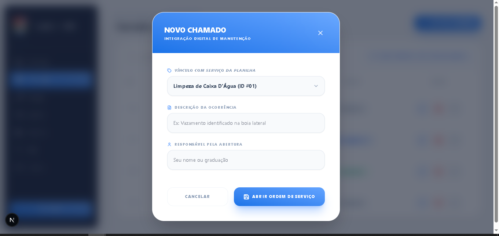
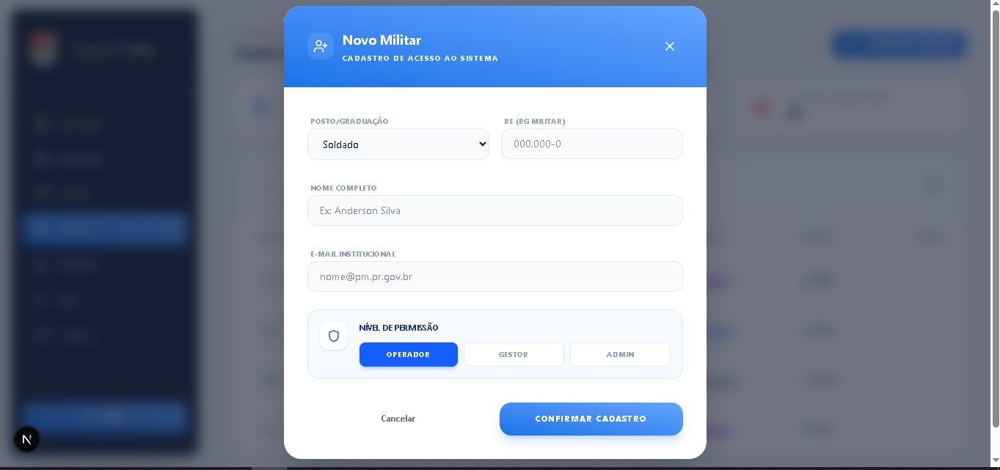

# 🛡️ Sistema de Gestão Interna - 17º BPM

<p align="center">
  
  
  
  
</p>

<p align="center">
  <strong>Plataforma inteligente para otimização de fluxos administrativos e controle operacional.</strong>
</p>

---

## 📖 Sobre o Projeto: De Planilhas para Performance Digital

O **Sistema de Gestão Interna - 17º BPM** nasceu de uma necessidade clara: modernizar e centralizar o controle de processos que, até então, dependiam de fluxos manuais e planilhas descentralizadas. O objetivo principal é converter a complexidade operacional em uma plataforma digital de alta performance, garantindo organização de dados, agilidade na consulta de informações e uma interface intuitiva para o militar.

Construído com **Next.js 15** e **React 19**, o sistema entrega uma experiência veloz, segura e preparada para escala.

---

### 🔄 A Grande Transformação: O Foco na Central de Serviços

O maior desafio e foco inicial do projeto foi a **Central de Serviços e Manutenções**. Anteriormente gerida através de uma planilha no Google Sheets (veja abaixo), a gestão sofria com a falta de alertas visuais, dificuldade na busca e risco de dados inconsistentes.

#### **O "Antes": Gestão Baseada em Google Sheets**
<p align="center">
  
  <br>
  <em>A planilha original: dados descentralizados, sem automação e com visualização complexa.</em>
</p>

#### **O "Depois": O Novo Sistema Digital**
Nossa solução transformou essa planilha em um **Painel de Controle Inteligente** (visível na seção "Visual Preview"), onde as mesmas informações agora possuem:

* **Indicadores Visuais (KPIs):** Contagem instantânea de serviços 'Atrasados', 'Em Alerta' e 'Em Dia'.
* **Busca e Filtros Dinâmicos:** Encontre qualquer manutenção ou item em segundos.
* **Lógica de Cálculo Automático:** O sistema prevê a próxima data de execução baseada na periodicidade e última execução.
* **UX Otimizada:** Modais de cadastro rápido e interface limpa para focar no que importa.

## 📸 Demonstração da Interface (Visual Preview)

<p align="center">
  Abaixo, apresentamos os fluxos principais já implementados. Toda a interface utiliza **dados simulados (Mock Data)** para validar a usabilidade antes da integração com o banco de dados.
</p>

<table width="100%" border="0" cellspacing="0" cellpadding="0">
  <tr>
    <td width="50%" valign="top" style="padding: 10px;">
      <div align="center" style="border: 1px solid #eaecef; border-radius: 12px; padding: 20px; height: 100%; box-shadow: 0 2px 4px rgba(0,0,0,0.05);">
        <p align="center">
          
        </p>
        <p align="center" style="font-size: 11px; color: #586069; margin-top: 5px; margin-bottom: 15px; min-height: 25px;">
          Autenticação segura para militares do 17º BPM.
        </p>
        
      </div>
    </td>
    <td width="50%" valign="top" style="padding: 10px;">
      <div align="center" style="border: 1px solid #eaecef; border-radius: 12px; padding: 20px; height: 100%; box-shadow: 0 2px 4px rgba(0,0,0,0.05);">
        <p align="center">
          
        </p>
        <p align="center" style="font-size: 11px; color: #586069; margin-top: 5px; margin-bottom: 15px; min-height: 25px;">
          Visão geral com indicadores de manutenção.
        </p>
        
      </div>
    </td>
  </tr>

  <tr>
    <td width="50%" valign="top" style="padding: 10px;">
      <div align="center" style="border: 1px solid #eaecef; border-radius: 12px; padding: 20px; height: 100%; box-shadow: 0 2px 4px rgba(0,0,0,0.05);">
        <p align="center">
          
        </p>
        <p align="center" style="font-size: 11px; color: #586069; margin-top: 5px; margin-bottom: 15px; min-height: 25px;">
          Fluxo de registro de militares e níveis de acesso.
        </p>
        
      </div>
    </td>
    <td width="50%" valign="top" style="padding: 10px;">
      <div align="center" style="border: 1px solid #eaecef; border-radius: 12px; padding: 20px; height: 100%; box-shadow: 0 2px 4px rgba(0,0,0,0.05);">
        <p align="center">
          
        </p>
        <p align="center" style="font-size: 11px; color: #586069; margin-top: 5px; margin-bottom: 15px; min-height: 25px;">
          Gestão de manutenções preventivas e periódicas.
        </p>
        
      </div>
    </td>
  </tr>

  <tr>
    <td width="50%" valign="top" style="padding: 10px;">
      <div align="center" style="border: 1px solid #eaecef; border-radius: 12px; padding: 20px; height: 100%; box-shadow: 0 2px 4px rgba(0,0,0,0.05);">
        <p align="center">
          
        </p>
        <p align="center" style="font-size: 11px; color: #586069; margin-top: 5px; margin-bottom: 15px; min-height: 25px;">
          Visualização consolidada de todas as manutenções e filtros.
        </p>
        
      </div>
    </td>
    <td width="50%" valign="top" style="padding: 10px;">
      <div align="center" style="border: 1px solid #eaecef; border-radius: 12px; padding: 20px; height: 100%; box-shadow: 0 2px 4px rgba(0,0,0,0.05);">
        <p align="center">
          
        </p>
        <p align="center" style="font-size: 11px; color: #586069; margin-top: 5px; margin-bottom: 15px; min-height: 25px;">
          Janela flutuante (Modal) para inserção rápida de novos itens.
        </p>
        
      </div>
    </td>
  </tr>
  <tr>
    <td width="50%" valign="top" style="padding: 10px;">
      <div align="center" style="border: 1px solid #eaecef; border-radius: 12px; padding: 20px; height: 100%; box-shadow: 0 2px 4px rgba(0,0,0,0.05);">
        <p align="center">
          
        </p>
        <p align="center" style="font-size: 11px; color: #586069; margin-top: 5px; margin-bottom: 15px; min-height: 25px;">
          Gerenciamento de chamados e ordens de serviço operacionais.
        </p>
        
      </div>
    </td>
    <td width="50%" valign="top" style="padding: 10px;">
      <div align="center" style="border: 1px solid #eaecef; border-radius: 12px; padding: 20px; height: 100%; box-shadow: 0 2px 4px rgba(0,0,0,0.05);">
        <p align="center">
          
        </p>
        <p align="center" style="font-size: 11px; color: #586069; margin-top: 5px; margin-bottom: 15px; min-height: 25px;">
          Modal de abertura rápida com vínculo direto à planilha master.
        </p>
        
      </div>
    </td>
  </tr>
  <tr>
    <td width="50%" valign="top" style="padding: 10px;">
      <div align="center" style="border: 1px solid #eaecef; border-radius: 12px; padding: 20px; height: 100%; box-shadow: 0 2px 4px rgba(0,0,0,0.05);">
        <p align="center">
          
        </p>
        <p align="center" style="font-size: 11px; color: #586069; margin-top: 5px; margin-bottom: 15px; min-height: 25px;">
          Visualização do efetivo cadastrado com indicadores de status e nível.
        </p>
        
      </div>
    </td>
    <td width="50%" valign="top" style="padding: 10px;">
      <div align="center" style="border: 1px solid #eaecef; border-radius: 12px; padding: 20px; height: 100%; box-shadow: 0 2px 4px rgba(0,0,0,0.05);">
        <p align="center">
          
        </p>
        <p align="center" style="font-size: 11px; color: #586069; margin-top: 5px; margin-bottom: 15px; min-height: 25px;">
          Interface modal para cadastro rápido de militares e definição de privilégios.
        </p>
        
      </div>
    </td>
  </tr>
  <tr>
    <td width="50%" valign="top" style="padding: 10px;">
      <div align="center" style="border: 1px solid #eaecef; border-radius: 12px; padding: 20px; height: 100%; box-shadow: 0 2px 4px rgba(0,0,0,0.05);">
        <p align="center">
          
        </p>
        <p align="center" style="font-size: 11px; color: #586069; margin-top: 5px; margin-bottom: 15px; min-height: 25px;">
          Painel de relatórios com filtros de exportação de dados para PDF e Excel.
        </p>
        
      </div>
    </td>
    <td width="50%" valign="top" style="padding: 10px;">
      <div align="center" style="border: 1px solid #eaecef; border-radius: 12px; padding: 20px; height: 100%; box-shadow: 0 2px 4px rgba(0,0,0,0.05);">
        <p align="center">
          
        </p>
        <p align="center" style="font-size: 11px; color: #586069; margin-top: 5px; margin-bottom: 15px; min-height: 25px;">
          Visualização de documento timbrado pronto para impressão oficial e arquivamento PDF.
        </p>
        
      </div>
    </td>
  </tr>
</table>

## 🏗️ Estratégia de Desenvolvimento e Refatoração

O projeto seguiu uma abordagem de **Evolução de Arquitetura**, dividida em duas fases principais:

1. **Fase de Prototipagem de Alta Fidelidade:** Construção das telas completas para validação imediata de fluxos de UI/UX, garantindo que a regra de negócio do 17º BPM fosse atendida visualmente.
2. **Fase de Componentização e Otimização:** Com as telas validadas, iniciamos um processo de "limpeza" de código, extraindo padrões repetitivos para uma biblioteca de componentes reutilizáveis. 

Isso resultou em um código **DRY (Don't Repeat Yourself)**, facilitando manutenções futuras e garantindo consistência visual em todo o sistema.


## 🧩 Arquitetura de Componentes Reutilizáveis

Para garantir a escalabilidade, o sistema conta com uma biblioteca de componentes customizados que padronizam a interface:

* **`DataTable.jsx`:** Abstração completa para listagens, com suporte a estados de busca e ações.
* **`StatCard.jsx`:** Cards de indicadores com variantes de status (Atrasado, Alerta, Em Dia).
* **`Modal.jsx`:** Componente flutuante unificado com animações `framer-motion` e lógica de fechamento padronizada.
* **`FormInput.jsx` & `FormSelect.jsx`:** Inputs customizados com altura padrão de `54px` (`h-13.5`) e estilos de foco consistentes.
* **`StatusBadge.jsx` & `PermissionBadge.jsx`:** Rótulos visuais para identificação rápida de níveis de acesso e estados de serviço.
* **`ActionButton.jsx`:** Botão principal com suporte a estados de carregamento (`loading`) e ícones dinâmicos.

---

## 🚀 Status do Desenvolvimento

### ✅ Já Implementado
* **Módulo de Acesso:** Telas de Login e Cadastro com validação de formulários.
* **Navegação Inteligente:** Menu lateral dinâmico com reconhecimento de página ativa.
* **Design System v2:** Padronização de componentes via Tailwind CSS (v4) com suporte a gradientes lineares.
* **Gestão de Usuários & Serviços:** Interface unificada para cadastro de efetivo e itens de manutenção.
* **Gestão de Efetivo e Acessos:** Painel administrativo para controle de militares cadastrados, níveis de privilégio e status operacional.
* **Painel de Indicadores:** Visualização de métricas e estatísticas em tempo real (Dashboard).
* **Central de Serviços:** Tabela dinâmica para gerenciamento de solicitações e prazos de manutenção.
* **📄 Relatórios Gerenciais:** Exportação de dados consolidados em PDF e Excel para o 17º BPM.
* **Central de Solicitações:** Tabela dinâmica para gerenciamento de chamados operacionais e ordens de serviço.
* **UX Polida:** Feedback visual de sucesso (Toasts), transições de entrada e cursor interativo em toda a aplicação.
* **Gestão de Sessão:** Fluxo de saída (Logout) com transições suaves.
* **🚀 Refatoração de Arquitetura:** Migração de telas monolíticas para um sistema baseado em componentes modulares, reduzindo a duplicidade de código em mais de 40%.

### 📈 Roadmap (Próximas Etapas)
1. **👥 Níveis de Permissão:** Lógica de controle de acesso baseada no perfil do usuário (Operador/Gestor/Adm).
2. **🔗 Conexão de Banco de Dados:** Implementação da persistência real dos dados de manutenção.

## 🛠️ Stack Tecnológic

| Ferramenta | Aplicação |
| :--- | :--- |
| **Next.js 15** | Framework Estrutural (App Router) |
| **React 19** | Componentização e Lógica de Interface |
| **Tailwind CSS** | Estilização Modernas e Responsividade |
| **Lucide React** | Biblioteca de Ícones |
| **Git/GitHub** | Versionamento e Organização de Código |

---

## 👤 Desenvolvedor

**Hildo Costa** *Software Developer*

<p align="left">
  <a href="https://www.linkedin.com/in/hildo-costa-b83812231/">
    
  </a>
  <a href="mailto:hyldo.costa@gmail.com">
    
  </a>
</p>

---

## ⚙️ Instalação Local

```bash
# 1. Clone o repositório
git clone [https://github.com/SEU_USUARIO/NOME_DO_REPO.git](https://github.com/SEU_USUARIO/NOME_DO_REPO.git)

# 2. Acesse o diretório
cd nome-do-projeto

# 3. Instale as dependências
npm install

# 4. Inicie o projeto
npm run dev
