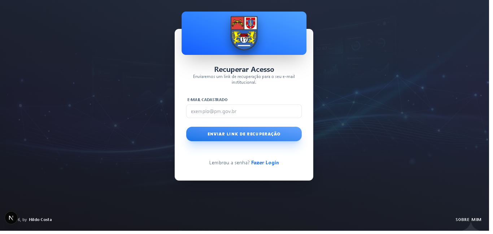
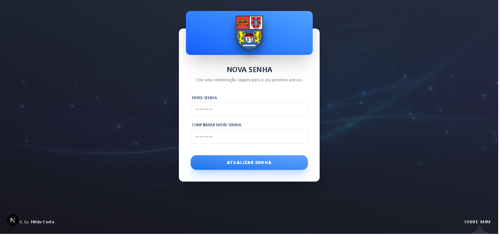
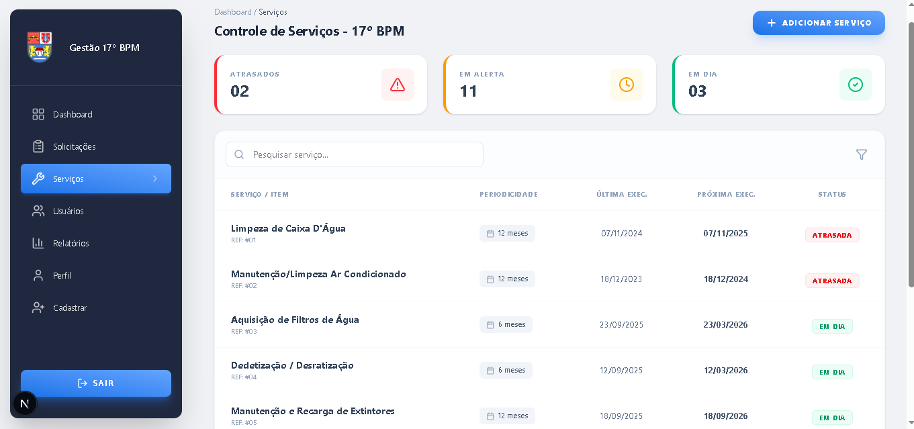
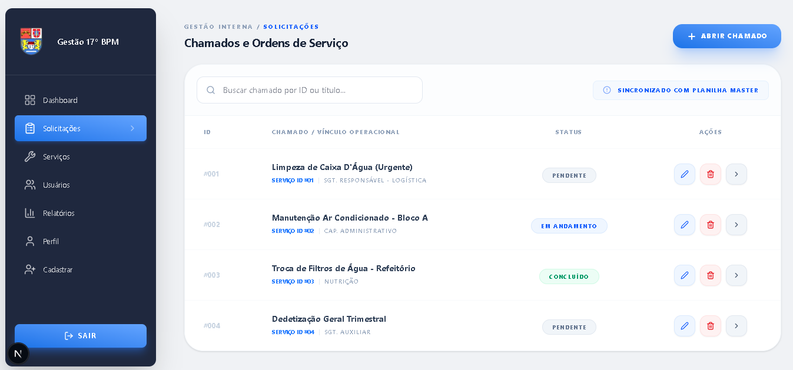
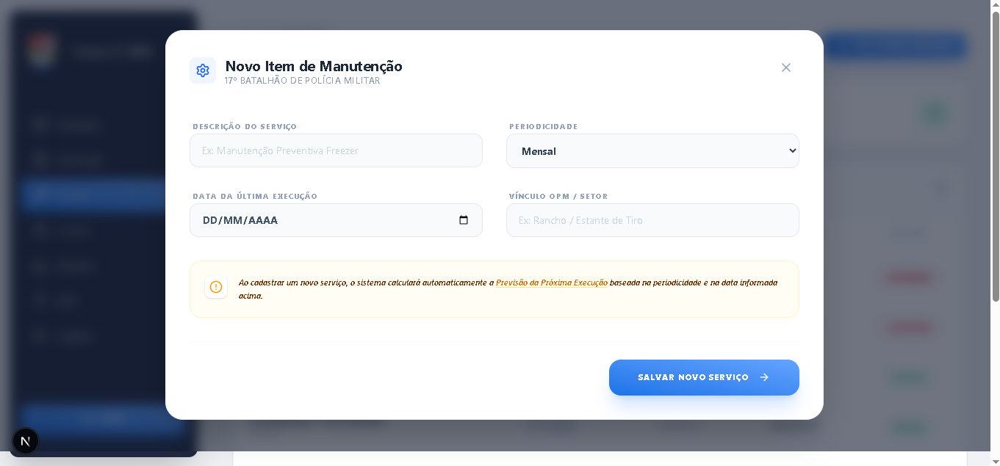
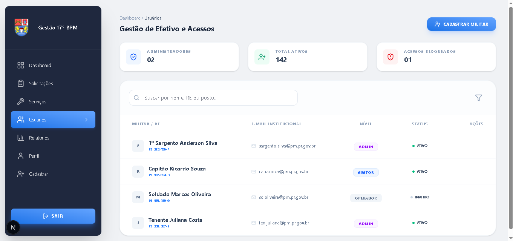
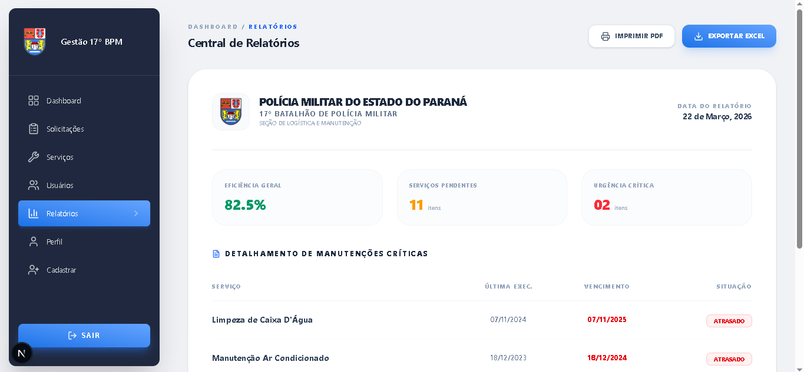

# 🛡️ Sistema de Gestão Interna - 17º BPM

  
  
  
  

  <strong>Plataforma inteligente para otimização de fluxos administrativos e controle operacional do 17º Batalhão de Polícia Militar.</strong>

---

## 📖 Sobre o Projeto: De Planilhas para Performance Digital

O **Sistema de Gestão Interna - 17º BPM** nasceu da necessidade de modernizar processos que dependiam de fluxos manuais e planilhas descentralizadas (Google Sheets). O projeto elimina o risco de inconsistência de dados e entrega uma interface intuitiva, rápida e focada na experiência do militar.

### 🔄 A Grande Transformação
* **Indicadores Visuais (KPIs):** Status instantâneo de serviços (Atrasados, Alerta, Em Dia).
* **Automação de Prazos:** Cálculo automático da próxima execução baseado na periodicidade.
* **Busca Dinâmica:** Filtros avançados para localização imediata de itens e manutenções.

---

## 🏗️ Arquitetura de Software

O sistema adota uma metodologia **Frontend-First** baseada em uma robusta **Arquitetura de Componentes Reutilizáveis**, garantindo escalabilidade e rigor visual.

### 🧩 Componentização Customizada
* **Estrutura:** `DataTable.jsx`, `TableActions.jsx`, `SearchInput.jsx`.
* **Formulários (H-54px):** `Input.jsx`, `FormSelect.jsx`, `ActionButton.jsx`.
* **Feedback:** `StatCard.jsx`, `StatusBadge.jsx`, `PermissionBadge.jsx`.
* **Layout:** `Sidebar.jsx`, `Modal.jsx`, `Card.jsx`, `Footer.jsx`.

---

## 📸 Demonstração da Transição Digital

### 🚩 O Ponto de Partida (Legacy)
Antes do sistema, a gestão era realizada através de planilhas, o que dificultava o controle de prazos e a visualização de indicadores em tempo real.

  
   
  <em>Interface anterior baseada em Google Sheets (Ponto de dor inicial).</em>

### 🚀 A Nova Interface (Visual Preview)

<table width="100%" border="0" cellspacing="0" cellpadding="0">
  <tr>
    <td width="50%" valign="top" style="padding: 10px;">
      

        

        
Autenticação segura para militares cadastrados.

        
      

    </td>
    <td width="50%" valign="top" style="padding: 10px;">
      

        

        
Interface de auto-cadastro para novos operadores.

        
      

    </td>
  </tr>

  <tr>
    <td width="50%" valign="top" style="padding: 10px;">
      

        

        
Solicitação de recuperação via e-mail institucional.

        
      

    </td>
    <td width="50%" valign="top" style="padding: 10px;">
      

        

        
Feedback de confirmação e orientações de segurança.

        
      

    </td>
  </tr>

  <tr>
    <td width="50%" valign="top" style="padding: 10px;">
      

        

        
Finalização do fluxo com criação de nova credencial.

        
      

    </td>
    <td width="50%" valign="top" style="padding: 10px;">
      

        

        
Visão geral com indicadores de manutenção (StatCards).

        
      

    </td>
  </tr>

  <tr>
    <td width="50%" valign="top" style="padding: 10px;">
      

        

        
Gestão de manutenções preventivas e periódicas.

        
      

    </td>
    <td width="50%" valign="top" style="padding: 10px;">
      

        

        
Listagem dinâmica com componente DataTable.

        
      

    </td>
  </tr>

  <tr>
    <td width="50%" valign="top" style="padding: 10px;">
      

        

        
Gerenciamento de chamados e ordens de serviço.

        
      

    </td>
    <td width="50%" valign="top" style="padding: 10px;">
      

        

        
Componente Modal unificado para inserção de dados.

        
      

    </td>
  </tr>

  <tr>
    <td width="50%" valign="top" style="padding: 10px;">
      

        

        
Listagem de militares com PermissionBadges.

        
      

    </td>
    <td width="50%" valign="top" style="padding: 10px;">
      

        

        
Painel de exportação de dados para PDF e Excel.

        
      

    </td>
  </tr>

  <tr>
    <td width="50%" valign="top" style="padding: 10px;">
      

        

        
Documento timbrado pronto para arquivo oficial.

        
      

    </td>
    <td width="50%" valign="top" style="padding: 10px;">
      </td>
  </tr>
</table>

---

## 🚀 Status do Desenvolvimento

### ✅ Já Implementado
* **Migração de Arquitetura:** Conversão de fluxos manuais (Google Sheets) para sistema robusto e centralizado.
* **Autenticação & Segurança:** Login, Cadastro e fluxo completo de Recuperação de Senha.
* **Componentização Reutilizável:** Design System proprietário com foco em consistência visual (DRY).
* **Navegação Dinâmica:** Sidebar com reconhecimento de contexto e rotas protegidas.
* **Gestão Operacional:** Dashboard com indicadores, controle de efetivo e chamados.
* **Exportação Profissional:** Gerador de relatórios timbrados em PDF e planilhas Excel.

### 📈 Roadmap
1. **🔗 Persistência:** Integração com banco de dados real (PostgreSQL/MongoDB).
2. **🔔 Notificações:** Alertas via sistema e e-mail para prazos de manutenção vencidos.

---

## 🛠️ Stack Tecnológica

| Ferramenta | Aplicação |
| :--- | :--- |
| **Next.js 15** | Framework Estrutural (App Router) |
| **React 19** | Lógica de Interface e Componentização |
| **Tailwind CSS** | Estilização Responsiva e Design System |
| **Lucide React** | Biblioteca de Ícones Vetoriais |

---

## 👤 Desenvolvedor

**Hildo Costa** - *Software Developer*

  
  

